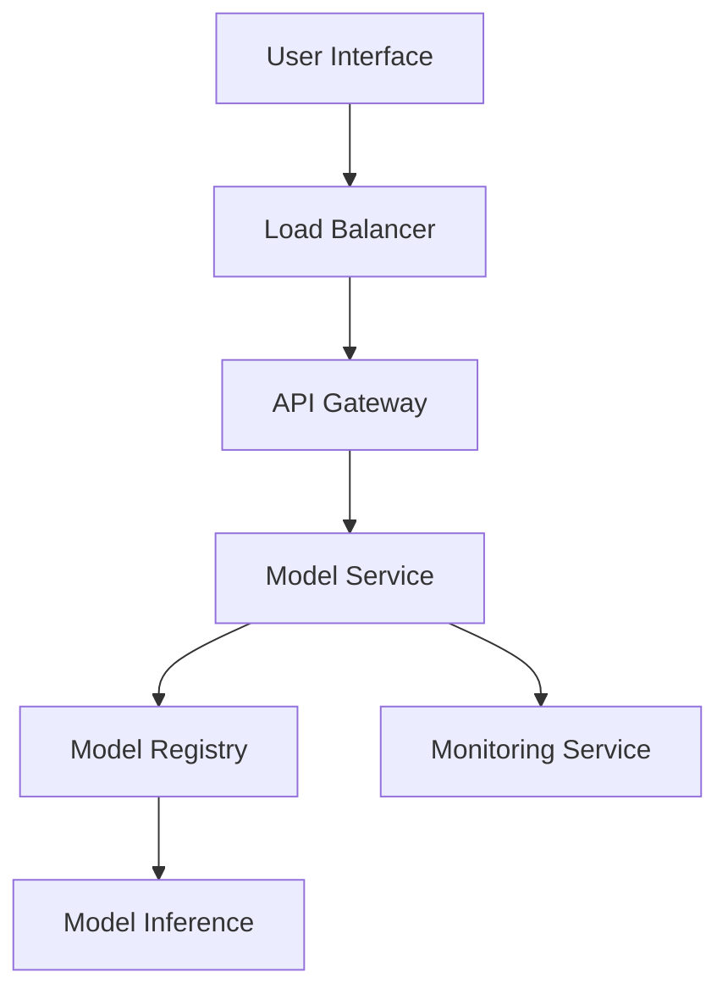

# Ad Click Prediction and Gender Classification with Behavioral Data

## Overview
This project explores the application of advanced machine learning techniques to solve two critical business problems:
1. **Gender Classification**: Identifying user demographics to enable personalized marketing strategies.
2. **Ad Click Prediction**: Estimating the probability of user engagement with advertisements.

By leveraging state-of-the-art algorithms and robust deployment pipelines, this project bridges the gap between academic research and real-world applications.

---

## Objectives
1. **Accurately classify user gender** based on behavioral data for targeted marketing.
2. **Predict ad click likelihood** to enhance digital advertising campaigns.
3. **Deploy scalable machine learning models** with user-friendly interfaces for seamless integration.

---

## Data Summary
### Dataset:
- **Source**: [Kaggle - Advertising Dataset](https://www.kaggle.com/datasets/hiimanshuagarwal/advertising-ef/data)
- **Features**: 10 variables, including Daily Time Spent on Site, Age, Area Income, and Daily Internet Usage.
- **Target Variables**:
  - Gender (binary: Female = 0, Male = 1)
  - Clicked on Ad (binary: No Click = 0, Click = 1)

### Preprocessing:
1. **Handling Missing Data**: Imputed using median for skewed distributions and mean otherwise.
2. **Encoding**: Applied one-hot and label encoding for categorical variables.
3. **Feature Scaling**: Standardized numerical features to improve model convergence.
4. **Feature Engineering**: Removed features like Ad Topic Line and Timestamp due to their irrelevance and complexity.

---

## Methodology
### Machine Learning Models:
1. **Logistic Regression (LR)**: Baseline linear model for probabilistic predictions.
2. **Decision Trees (DT)**: Non-linear model capturing complex decision boundaries.
3. **Support Vector Machines (SVM)**: High-margin classifier for robust performance.
4. **Naive Bayes (NB)**: Probabilistic model leveraging feature independence.
5. **XGBoost**: State-of-the-art ensemble learning method.

### Deployment Strategy:
1. **Streamlit Application**:
   - Interactive UI for real-time predictions.
   - Batch and manual inference modes.
2. **Docker**:
   - Containerization ensures consistent deployments across platforms.
   - Facilitates scalability and reliability.
3. **MLOps Pipeline**:
   - Automated workflows for model retraining and monitoring.
   - Dynamic model management for runtime updates.

---

## Results and Performance
### Gender Prediction:
| **Model**         | **Accuracy** | **Precision** | **Recall** | **F1-Score** | **ROC-AUC** |
|--------------------|--------------|---------------|------------|--------------|-------------|
| SVM               | 94.87%       | 0.945         | 0.952      | 0.948        | 0.946       |
| Naive Bayes       | 96.04%       | 0.962         | 0.958      | 0.960        | 0.959       |

### Ad Click Prediction:
| **Model**         | **Accuracy** | **Precision** | **Recall** | **F1-Score** | **ROC-AUC** |
|--------------------|--------------|---------------|------------|--------------|-------------|
| Logistic Regression| 95.21%      | 0.948         | 0.956      | 0.952        | 0.951       |
| XGBoost           | 96.04%       | 0.962         | 0.962      | 0.962        | 0.960       |

### Key Observations:
- **SVM** excels in gender classification with balanced precision and recall.
- **XGBoost** outperforms for ad click prediction due to its ensemble approach.

---

## Advanced Features
1. **Hyperparameter Tuning**:
   - Grid and randomized search for optimal parameters.
   - Boosted model performance by up to 5%.
2. **Real-Time Monitoring**:
   - Integrated monitoring service tracks model drift and accuracy.
   - Alerts for retraining triggered by significant performance drop.
3. **Feature Importance Analysis**:
   - Daily Internet Usage emerged as the most influential feature.
   - Age and Area Income followed in importance.

---

## Production Architecture


---

## Repository Structure
```
├── data/
│   ├── raw/                   # Raw dataset
│   └── processed/             # Processed dataset
├── models/
│   ├── xgboost/               # XGBoost model files
│   ├── svm/                   # SVM model files
│   ├── decision_tree/         # Decision Tree files
│   └── logistic_regression/   # Logistic Regression files
├── notebooks/
│   └── model_development.ipynb # Jupyter notebooks for experiments
├── src/
│   ├── preprocessing/         # Data preprocessing scripts
│   ├── training/              # Training pipelines
│   └── evaluation/            # Evaluation metrics and scripts
├── deployment/
│   ├── docker/                # Docker-related files
│   └── kubernetes/            # Kubernetes deployment configurations
├── docs/
│   └── api/                   # API documentation
├── tests/
│   └── unit/                  # Unit tests for robustness
└── streamlit_app/             # Frontend for user interaction
```

---

## Contributors
- **Amrut Deshpande**: XGBoost Implementation and Optimization
- **Dakshinamoorthy Thavamani**: Decision Tree Algorithm and Tuning
- **Harish Shankarachari**: Data Preprocessing and Visualization
- **Jignesh Shah**: Feature Engineering and MLOps Integration
- **Pratima Verma**: Logistic Regression Analysis
- **Sonali Maurya**: SVM Implementation and Hyperparameter Tuning

---

## Acknowledgments
This work was guided by Prof. Sashikumaar Ganesan as part of the CCE-2024 AI & Machine Learning curriculum at IISc Bangalore. We thank the faculty and peers for their invaluable feedback.

---

## License
This project is licensed under the MIT License.

---

## Contact
For any inquiries or collaborations, please reach out via [GitHub Repository](https://github.com/IISC-GROUP-5/) or [Streamlit Application](https://iisc-group5.streamlit.app/).
