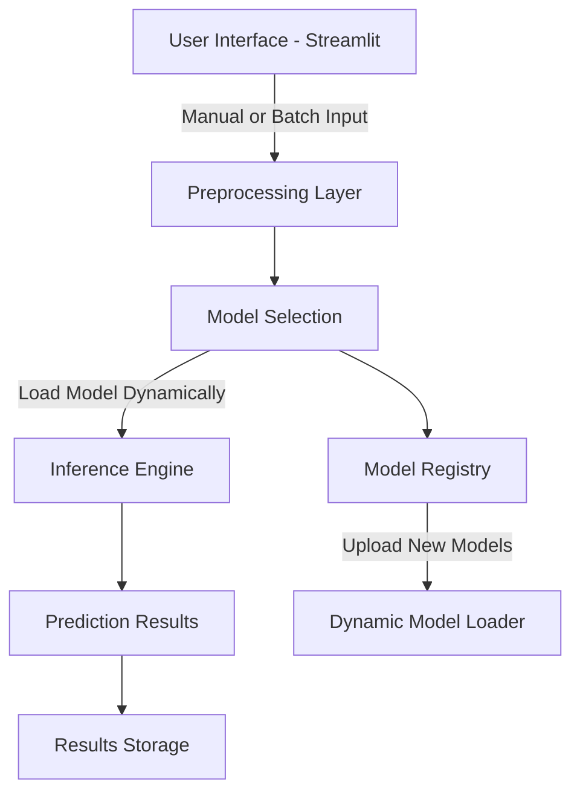

# Ad Click Prediction and Gender Classification with Behavioral Data

## Overview
This project applies advanced machine learning techniques to analyze user behavioral data for two critical business tasks:
1. **Gender Classification**: Determining user gender to enable personalized marketing strategies.
2. **Ad Click Prediction**: Estimating the probability of users engaging with advertisements.

The project integrates state-of-the-art algorithms, a modularized codebase, and a robust deployment pipeline for real-world applicability.

---

## Objectives
1. **Enhance model accuracy** for gender classification and ad-click prediction through advanced feature engineering and algorithmic tuning.
2. **Enable dynamic model management** for real-time inference using Streamlit and Docker.
3. **Ensure scalable deployment** with cross-platform compatibility and automated workflows.

---

## Data Description
### Dataset:
- **Source**: [Kaggle - Advertising Dataset](https://www.kaggle.com/datasets/hiimanshuagarwal/advertising-ef/data)
- **Features**: 
  - **Numerical**: Daily Time Spent on Site, Age, Area Income, Daily Internet Usage.
  - **Categorical**: Ad Topic Line, City, Country, Timestamp.
- **Target Variables**:
  - Gender (binary: Female = 0, Male = 1)
  - Clicked on Ad (binary: No Click = 0, Click = 1)

### Preprocessing:
1. **Data Imputation**: Median for skewed distributions and mean for symmetric ones.
2. **Encoding**: One-hot and label encoding for categorical variables.
3. **Feature Scaling**: Standardized numerical features to improve convergence.
4. **Feature Engineering**: Dropped complex features like Ad Topic Line, City, Country, and Timestamp.

---

## Methodology
### Machine Learning Models:
1. **Logistic Regression (LR)**: Baseline model for probabilistic predictions.
2. **Decision Trees (DT)**: Non-linear models for interpretable decision boundaries.
3. **Support Vector Machines (SVM)**: High-margin classifiers for robust generalization.
4. **Naive Bayes (NB)**: Probabilistic models leveraging conditional independence.
5. **XGBoost**: Ensemble learning model for high accuracy and scalability.

### Model Evaluation Metrics:
- Accuracy
- Precision
- Recall
- F1-Score
- ROC-AUC

### Deployment and MLOps:
1. **Streamlit Application**:
   - Enhanced GUI with support for manual and batch predictions.
   - Dynamic model updates via file uploads.
2. **Docker**:
   - Ensures consistent environments across platforms.
   - Streamlines deployment workflows.
3. **MLOps Pipeline**:
   - Monitors model performance and triggers retraining workflows.
   - Automates inference and result storage processes.

---


## Results and Insights

### Gender Classification:
| **Model**         | **Accuracy** | **Precision** | **Recall** | **F1-Score** | **ROC-AUC** |
|--------------------|--------------|---------------|------------|--------------|-------------|
| Logistic Regression| 49.50%      | 0.667         | 0.128      | 0.215        | 0.471       |
| Decision Tree      | 47.52%      | 0.517         | 0.431      | 0.470        | 0.479       |
| Naive Bayes        | 45.05%      | 0.458         | 0.101      | 0.165        | 0.524       |
| SVM                | 51.98%      | 0.556         | 0.551      | 0.553        | 0.480       |
| XGBoost            | 48.02%      | 0.521         | 0.459      | 0.488        | 0.482       |


### Ad Click Prediction:
| **Model**         | **Accuracy** | **Precision** | **Recall** | **F1-Score** | **ROC-AUC** |
|--------------------|--------------|---------------|------------|--------------|-------------|
| Logistic Regression| 95.05%      | 0.953         | 0.953      | 0.953        | 0.994       |
| Decision Tree      | 94.06%      | 0.920         | 0.972      | 0.945        | 0.939       |
| Naive Bayes        | 95.54%      | 0.953         | 0.962      | 0.958        | 0.994       |
| SVM                | 95.54%      | 0.953         | 0.962      | 0.958        | 0.992       |
| XGBoost            | 96.04%      | 0.962         | 0.962      | 0.962        | 0.960       |

---

## Production Architecture


### Architecture Description:
1. **User Interface**: Streamlit provides an interactive GUI for manual and batch input processing.
2. **Preprocessing Layer**: Handles transformations, scaling, and encoding.
3. **Model Selection**: Dynamically loads models from the `models/` directory.
4. **Inference Engine**: Executes predictions for both manual and batch input data.
5. **Results Storage**: Saves prediction outputs in the `results/` directory.
6. **Model Registry**: Maintains existing models and integrates newly uploaded ones.
7. **Dynamic Model Loader**: Enables seamless model updates without system redeployment.

---

## Repository Structure
```
├── data/
│   ├── raw/                   # Raw dataset
│   └── processed/             # Processed dataset
├── models/
│   ├── xgboost/               # XGBoost model files
│   ├── svm/                   # SVM model files
|   ├── naive_bayes/                    # Naive Bayes model files  
│   ├── decision_tree/         # Decision Tree files
│   └── logistic_regression/   # Logistic Regression files
├── notebooks/
│   └── model_development.ipynb # Jupyter notebooks for experiments
├── src/
│   ├── preprocessing/         # Data preprocessing scripts
│   ├── training/              # Training pipelines
│   └── evaluation/            # Evaluation metrics and scripts
├── deployment/
│   ├── docker/                # Docker-related files
│   └── kubernetes/            # Kubernetes deployment configurations
├── docs/
│   └── api/                   # API documentation
├── tests/
│   └── unit/                  # Unit tests for robustness
└── streamlit_app/             # Frontend for user interaction
```

---

## Contributors
- **Amrut Deshpande**: XGBoost Implementation and Optimization
- **Dakshinamoorthy Thavamani**: Decision Tree Development
- **Harish Shankarachari**: Data Preprocessing and Visualization
- **Jignesh Shah**: Feature Engineering and MLOps Integration
- **Pratima Verma**: Logistic Regression Analysis
- **Sonali Maurya**: SVM and Naive Bayes Implementation and Hyperparameter Tuning

---

## Acknowledgments
This project was developed under the guidance of Prof. Sashikumaar Ganesan at IISc Bangalore as part of the CCE-2024 curriculum. Special thanks to the faculty and peers for their valuable feedback.

---

## License
This project is licensed under the MIT License.

---

## Contact
For inquiries or collaborations, visit our [GitHub Repository](https://github.com/IISC-GROUP-5/) or the [Streamlit Application](https://iisc-group5.streamlit.app/).
